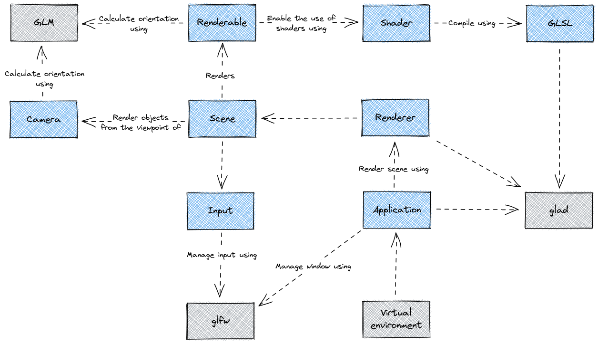

# Documentation

## Application model

Each blue object in the image should be developed at some point. The starting point is the `Application` object. This will start the main loop. The `Renderer` object is next. After that, the `Scene` and `Camera`. Those can be build simultaneously to make development easier. The second last step is creating the actual `Renderable` objects along with the `Shader` object and `GLSL`. The last step in the basic application model is the user `Input`.

From there we can move to more advanced things like importing actual models, adding light sources and so on.

> All objects defined in the image should be accessible outside the library. They can be used to build an actual virtual world.

